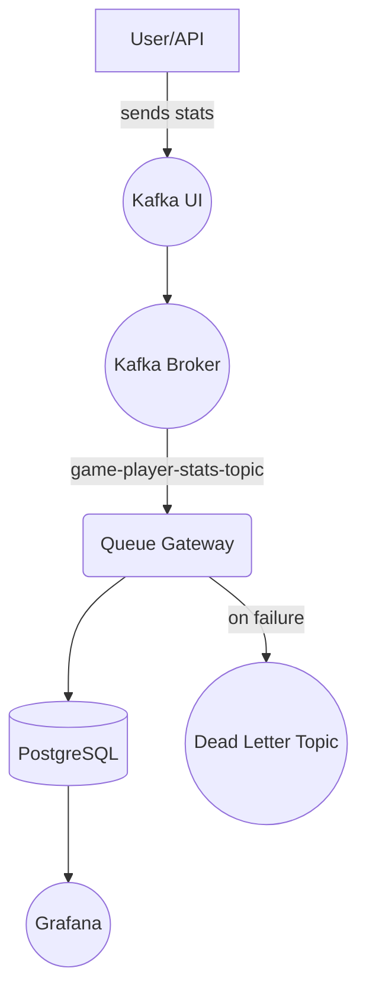

# NBA Games Statistics collecting and processing system
The system collects NBA Games Players statistics, stores it and provide
season reports for teams and single players.

## Flow



## 🚀 Prerequisites

- Docker + Docker Compose
- Java 17
- Gradle 8+

## 🏗️ Build

```bash
./gradlew build
```

## 🐳 Run Everything with Docker Compose

```bash
docker-compose up --build
```

This will spin up:

- PostgreSQL
- pgAdmin (at port 8094)
- Kafka + Zookeeper
- Kafka UI (at port 9000)
- Grafana (at port 3000)
- queue_gateway ([queue-gw](queue-gw/README.md))

## 📂 Environment Variables

Stored in the `.env` file:

```env
POSTGRES_USER=stats_user
POSTGRES_PASSWORD=stats_pass
POSTGRES_DB=nba-games-stats
KAFKA_BOOTSTRAP_SERVERS=kafka:9092
```

---

# ↻ [queue-gw - Spring Boot Microservice](queue-gw/README.md)

This module handles message processing and exposes actuator health checks.

---

## 🧪 Testing Kafka Topics

### Kafka UI

Access the Kafka UI at:

```
http://localhost:9000
```

### Example: Publish to `game-player-stats-topic`

1. Go to `Topics` → `game-player-stats-topic`
2. Click **Produce message**
3. Example message:

```json
{
  "season": "2024-2025",
  "game": "GAME12345",
  "team": "LAL",
  "playerName": "LeBron James",
  "points": 27,
  "rebounds": 8,
  "assists": 9,
  "steals": 2,
  "blocks": 1,
  "fouls": 3,
  "playedMinutes": 35.5
}
```

The message will be consumed by `queue_gateway` and stored in PostgreSQL.

---
## 📅 pgAdmin

- URL: `http://localhost:8094`
- Login: `statsadmin@example.com / test`
- Preloaded with connection to `nba-games-stats` database

The records of received game player stats are stored in
**game-player-stats** table and player stats aggregations over a season at **season_player_stats_report** table.
The db tables and stored procedures/functions initialized by [initdb.sql](docker/initdb/initdb.sql) script.

---

## 📊 Grafana Dashboard

- URL: `http://localhost:3000`
- Login: `admin / admin`
- Chose 'Home' -> 'Dashboards' -> Folder: **NBA Stats** - See the final dashboard with reports there.
---

## 📥 API Endpoints

> Currently only exposes Actuator health at:

```
GET /actuator/health
```

More functionality will be added in future modules.

